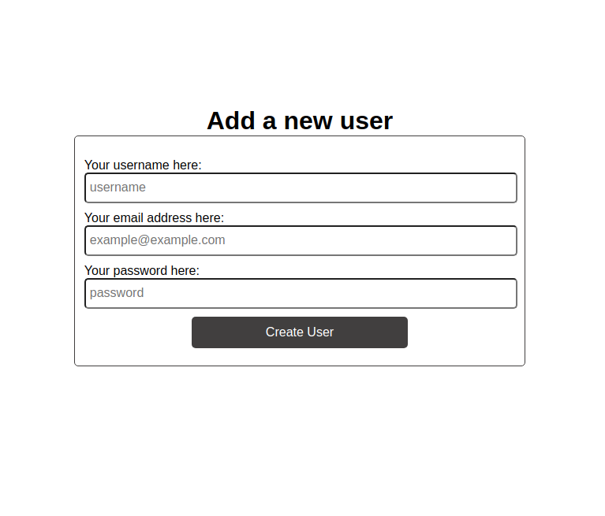
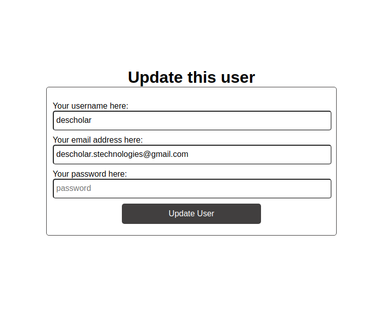

# Re-former

## Project description
This project is for learning purpose just to get familiar with Forms and helpers in ruby on rails. It is gotten from [The Odin Project](https://www.theodinproject.com/courses/ruby-on-rails/lessons/forms).

## Tools and technologies used to build this project
1. [Ruby 2.7.1](https://www.ruby-lang.org/en/news/2020/03/31/ruby-2-7-1-released/)
1. [Ruby on Rails 6.0.3.2](https://weblog.rubyonrails.org/2020/6/17/Rails-6-0-3-2-has-been-released/)

## Running and testing it locally

### Prerequisites
1. You should have [Ruby 2.7.1](https://www.ruby-lang.org/en/news/2020/03/31/ruby-2-7-1-released/)
1. You need to have [Rails 6.0.3.2](https://weblog.rubyonrails.org/2020/6/17/Rails-6-0-3-2-has-been-released/)
1. You need to have [Yarn v1.22.4](https://yarnpkg.com/)

### Setup
1. Clone this repository with `git clone https://github.com/descholar-ceo/re-former`

1. Go inside this repo locally by typing `cd re-former`

1. Run `bundle install` to install all ruby dependecies

1. Run `yarn` to install js dependencies

1. Run `bin/rails db:migrate` to create necessary tables in database

### Testing
1. Start the server by running `bin/rails server`, if all of the above steps has been followed correctly, you should get a server started on `https://127.0.0.1:3000` or easily `https://localhost:3000`
1. Go to these paths:
```bash
    GET   /users/new => Create a user 1
    GET   /users/1/edit => Edit user 1
```

and observe the changes in your terminal

### The forms look like the following on the screensgots
|Add a new user|Update existing user|
|-|-|
|||
|||

## Contributing
There are two ways of contributing to this project:

1. If you see something wrong or not working, please open the issue in [issue section](https://github.com/descholar-ceo/re-former/issues)
1. If you see something to improve or to correct, and you have a solution to that, follow the below steps to contribute:
    1. Fork this repository
    1. Clone it on your local computer by running `git clone https://github.com/descholar-ceo/re-former.git` __Replace *your username* with the username you use on github__
    1. Open the cloned repository which appears as a folder on your local computer with your favorite code editor
    1. Create a separate branch off the *master branch*,
    1. Write your codes which fix the issue you found
    1. Commit and push the branch you created
    1. Open a pull request, comparing your new created branch with our original master branch [here](https://github.com/descholar-ceo/re-former)

## Authors
### 1. MUGIRASE Emmanuel
* Github: [@descholar-ceo](https://github.com/descholar-ceo)
* Twitter: [@descholar3](https://twitter.com/descholar3)
* LinkedIn: [MUGIRASE Emmanuel](https://www.linkedin.com/in/mugirase-emmanuel)

### 2. Witah Ngu Georjane
* Github: [@Georjane](https://github.com/Georjane)
* Twitter: [@WittyJany](https://twitter.com/WittyJany)
* LinkedIn: [Witah Georjane](https://www.linkedin.com/in/witah-georjane)


## Show your support 
Give a ⭐️ if you like this project!

## Acknowledgment
* [Microverse](https://www.microvese.org)
* [The Odin Project](https://www.theodinproject.com)
